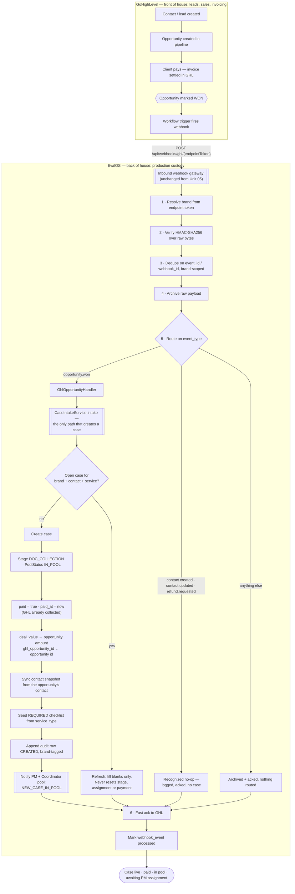
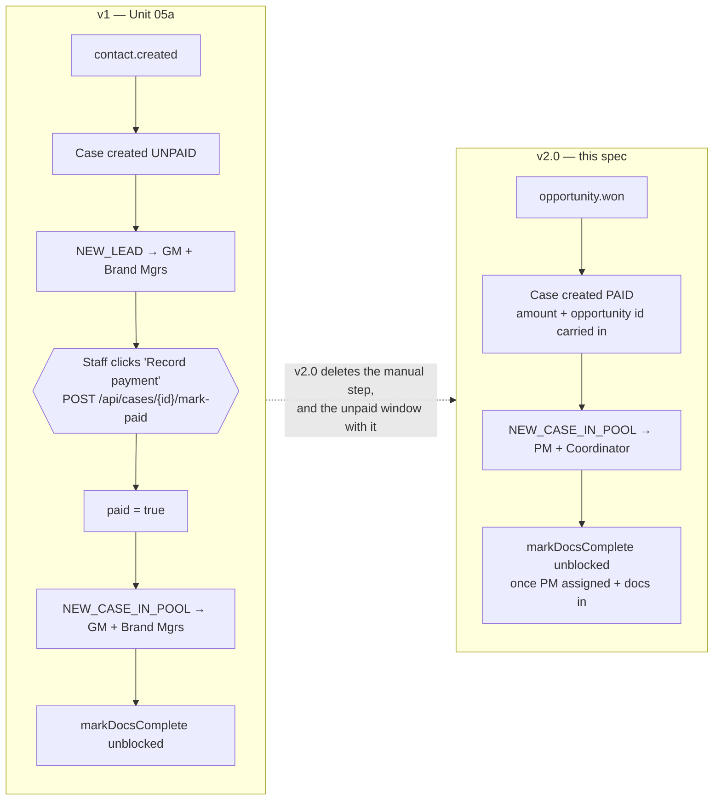

# Unit 05b — Case Creation v2.0: the won opportunity is the trigger (Handoff A)

> **Current truth for Handoff A.** Supersedes the handler half of
> `05-inbound-gateway-handoff-a.md` and all of Unit 05a. The gateway half of spec 05
> — verify, resolve brand, dedupe, archive, route, ack — is unchanged and stays as
> written there.

**Phase:** 2 — re-pointing a Phase 1 unit
**Depends on:** 03, 04, 05, 05a (this replaces 05a's handler)
**Unlocks:** nothing new; 18 gains `ghl_opportunity_id` to close the opportunity with

---

## Why the trigger moved, again

Handoff A has now fired on three different events, and the reason is the same each
time: **whoever owns the money decides when a case exists.**

| | Trigger | Case born | Payment recorded by |
|---|---|---|---|
| Unit 05 | `payment.confirmed` | paid | the webhook |
| Unit 05a | `contact.created` | **unpaid** | a GM/Brand Manager, by hand |
| **v2.0 (this)** | **`opportunity.won`** | **paid** | the webhook |

Unit 05a moved off payment because "the business does not wait for money to start a
case." That is no longer true, and the reason is that GHL grew into the whole sale:
it captures the lead, opens the opportunity, issues the invoice and **collects**. By
the time a salesperson drags an opportunity to **Won**, the money is in.

So the won-opportunity event carries both facts at once — *this is real work* and
*it has been paid for* — and it carries the amount with them. There is nothing left
for a human to record, which is why the manual step is deleted rather than kept as a
fallback: a second way to say "paid" is a second thing that can disagree with GHL,
and GHL is the system that actually took the money.

**What this deliberately gives up.** In v1 a case existed while still unpaid, and
document collection against it was allowed on the grounds that it "costs EvalOS
nothing." v2.0 closes that window: EvalOS never sees a lead and cannot start
collecting documents before the deal closes. That is the intended trade — leads and
chasing are front-of-house work, and front of house is GHL.

---

## The pipeline



### Old vs new



---

## Payload contract

Modelled on the shape that already works for `contact.created` — `event_type` and
`event_id` are the **gateway's** fields at the top level, `service_type` is
top-level, and the person is nested under `contact`. v2.0 adds an `opportunity`
block and drops `quote_amount`, because the won opportunity's `amount` is what was
actually collected, not a quote.

```json
{
  "event_type": "opportunity.won",
  "event_id": "evt-<unique>",
  "opportunity": {
    "ghl_opportunity_id": "opp-<unique>",
    "amount": 900,
    "status": "won"
  },
  "contact": {
    "ghl_contact_id": "ghl-<unique>",
    "full_name": "Anita Rao",
    "email": "<unique>@example.test",
    "client_type": "INDIVIDUAL",
    "source": "WEBSITE"
  },
  "service_type": "EXPERT_OPINION_LETTER",
  "visa_category": "EB2_NIW",
  "invoice_ref": "INV-0001",
  "drive_link": "https://drive.google.com/drive/folders/<anything>"
}
```

- Without `event_type` → `400 MISSING_EVENT_TYPE`. Without `event_id` *and*
  `webhook_id` → `400 MISSING_EXTERNAL_ID`. Never key idempotency on a bare `id` or
  on `ghl_opportunity_id` — both are resource ids, and the second would make a
  legitimately re-won opportunity look like a duplicate delivery.
- `invoice_ref` is optional. `amount` is required and must be positive: a won
  opportunity with no money on it is a data error in GHL, not a free case.
- **The field names above are still an assumption**, exactly as they were in 05a.
  Confine them to `GhlOpportunityHandler.OpportunityWon` so a correction is one
  file. The open question in `progress-tracker.md` now reads: which GHL workflow
  event actually fires on Won, what it calls the opportunity's amount and id, the
  signature header name, and the HMAC encoding.

---

## Implementation contract

### Route the new event
`webhook/WebhookRouter.java` — `OPPORTUNITY_WON = "opportunity.won"` becomes the
live type routed to `GhlOpportunityHandler`. **`contact.created` moves into the
existing `DEFERRED` no-op set** beside `contact.updated` and `refund.requested`; it
must not route to intake. Unknown types keep being archived, acked and logged.

### Replace the handler
`GhlContactHandler` → `GhlOpportunityHandler`, keeping the same three-step shape
(`parse` → `validated` → `toCommand`) and the same reason for it: parse then
validate *in full* before calling the service, so a malformed delivery is a 400 GHL
will not retry rather than a half-created case. Keep the transport-record /
`NewCase` split — that duplication is what keeps an unconfirmed payload shape out of
`service`. Drop the payload's `paid` field: **won is paid**, so it is not the
payload's to assert.

### Intake records the payment
`service/CaseIntakeService` — `newCase()` always sets `paid = true` and
`paidAt = now()`, plus `dealValue` from `opportunity.amount` and the new
`ghlOpportunityId`. `refresh()` keeps its contract: never resets stage, never drops an
assignment, never un-pays, publishes no lifecycle event.

**One deliberate exception to fill-only: `refresh()` must now *overwrite*
`dealValue`.** This is a consequence of deleting `markPaid`, and it has to be
handled rather than discovered. `setDealValue` has exactly three call sites — the two
in intake and the one inside `markPaid` — so **deleting `markPaid` removes the only
writer that could ever correct an amount after creation**, and `refresh()` currently
fills it only `if (getDealValue() == null)`. Left alone, a case whose amount changed
in GHL would keep the first figure forever, with nothing anywhere able to fix it, and
`deal_value` feeds revenue recognition.

The old spec kept `mark-paid` callable on a paid case precisely because "the amount is
correctable". v2.0 does not lose that — it moves it: **GHL is now the source of truth
for the amount, so the won opportunity's `amount` is authoritative and a later
delivery overwrites.** `paid` / `paid_at` stay write-once; only the figure is
correctable, still one value and never a running total, so a correction cannot
double-count.

### Delete the manual payment path
Five sites, all deletions:

- `web/CaseController.java` — the `POST /{id}/mark-paid` endpoint and its
  `MarkPaidRequest` record.
- `service/CaseLifecycleService.java` — `markPaid(...)` and `requirePaymentRole()`.
- `service/CaseTransitions.java` — the `MARK_PAID` rows. Before deleting the
  `Action.MARK_PAID` constant, **confirm no persisted column stores `Action`** — the
  audit trail stores `AuditAction`, so this should be safe, but audit is append-only
  and a historical row must stay readable.
- `frontend/src/features/board/boardRules.ts` — the `mark-paid` action entry with
  its `dealValue` / `invoiceRef` fields.
- Their tests.

### Move the pool alert to PM + Coordinator
`notification/NotificationListeners.java` — `CASE_CREATED` now maps to
`NEW_CASE_IN_POOL` addressed to the PM/Coordinator pool. Remove the `CASE_PAID`
route and stop emitting `NEW_LEAD`; every case now arrives paid, so "New lead, not
paid yet" can never be true. **Keep the enum constants** `NotificationType.NEW_LEAD`
and `CaseEvents.Type.CASE_PAID` — both are persisted as text on existing rows, so
stop emitting them rather than deleting them. Keep the `alreadyRaised` once-only
guard on `NEW_CASE_IN_POOL`.

`notification/RecipientResolver.java` — add `pmsAndCoordinators(brandId)`, following
the existing `gmAndBrandManagers` union pattern and reusing
`teamMembers.findByActiveTrueAndRoleAndBrandId` with `Role.PROJECT_MANAGER`, unioned
with the existing `coordinators(brandId)`. No new repository method is needed.

### One migration
`V24__case_ghl_opportunity.sql` — add `ghl_opportunity_id text` to `evalos_case`,
plus a **partial unique index per brand scoped to open cases**:

```sql
CREATE UNIQUE INDEX uq_case_open_per_opportunity
    ON evalos_case (brand_id, ghl_opportunity_id)
    WHERE ghl_opportunity_id IS NOT NULL AND current_stage <> 'CLOSED';
```

**The `current_stage <> 'CLOSED'` clause is load-bearing, and leaving it out is a
500 waiting to happen.** The open-case lookup
(`findFirstBy…CurrentStageNotOrderByCreatedAtDesc(…, Stage.CLOSED)`) deliberately
ignores closed cases, so a client who returns after their first case closed takes the
**create** path — which this spec elsewhere calls out as new business, not a
duplicate. If GHL re-uses or re-wins that opportunity id, an unscoped index turns
legitimate repeat business into a constraint violation: a 5xx that GHL retries
forever, and no case for a deal that was genuinely paid for. Scoping to open cases
matches `V15` exactly and is the same reasoning.

Enforcement belongs in the index, not the lookup, because a check-then-act is a race
two concurrent deliveries both win. Never edit `V1`–`V23`.

Note this index guards a *different* thing from idempotency: the gateway's
`event_id` dedupe stops a redelivered **webhook**; this stops a second **case** for
one opportunity. Neither replaces the other, and the id is still never an
idempotency key.

### Keep the structural lock
`test/java/com/ie/evalos/domain/DomainInvariantsTest` scans the classpath for who
may inject `CaseIntakeService`. Change the single allowed class to
`GhlOpportunityHandler`, so invariant 8 still fails the build if anyone adds another
path that creates a case.

### Kept deliberately
`paid` / `paid_at` stay, and so does the unpaid guard on `markDocsComplete`. Every
case is now born paid, so the guard is normally satisfied on arrival — but it is one
line in one place, `RefundService.isRevenueRecognized` and Unit 13's full-profile
`409` both read `paid`, and a GM-approved refund still has to be able to make a paid
case not-earned. Dropping the column would be a larger diff that buys nothing.

---

## Acceptance criteria

1. One `opportunity.won` delivery creates **exactly one** case: `DOC_COLLECTION`,
   `IN_POOL`, `paid = true`, `paid_at` set, `deal_value` = the opportunity amount,
   `ghl_opportunity_id` set, brand taken from the endpoint token and never the body.
2. That case has its REQUIRED checklist seeded from `service_type`, a synced contact
   snapshot, and one brand-carrying audit row (`CREATED`).
3. Exactly one `NEW_CASE_IN_POOL` notification, to the brand's PMs and Project
   Coordinators. No `NEW_LEAD` is raised by anything.
4. A replayed delivery (same `event_id`) creates nothing and answers `duplicate`. A
   redelivery after a *handler failure* retries and succeeds.
5. A `contact.created` delivery creates no case and is acked.
6. A second `opportunity.won` for the same contact **and** service refreshes the
   open case without moving its stage, assignment or payment — **but a changed
   `amount` does overwrite `deal_value`**, since nothing else can correct it once
   `markPaid` is gone.
7. `POST /api/cases/{id}/mark-paid` returns 404 — the route is gone — and no board
   action offers to record payment.
8. A wrong signature is `401`; an unknown endpoint token is `404`; a body with no
   `event_id`/`webhook_id` is `400`.
9. `./mvnw verify` green, including the DB-gated checks against local Postgres with
   `V24` applied and `ddl-auto=validate` passing.

---

## Docs and memories this unit must leave consistent

Already done alongside this spec: `architecture.md` (Handoff A, invariants 5 and 8,
the inbound event list), `project-overview.md` (goal 1, core flow step 1, Handoff A
summary), `00-build-plan.md` (the Unit 05 entry and its trigger note), spec 05's
superseded banner, `progress-tracker.md`, and the memories `core`,
`backend/webhooks`, `backend/lifecycle`, `backend/persistence`, `frontend/core`.

**Outside this repo:** the EvalOS Technical Design Document v1.1 is named
authoritative by `CLAUDE.md` but does not live in the tree. It still describes the
old trigger and must be updated by hand.
